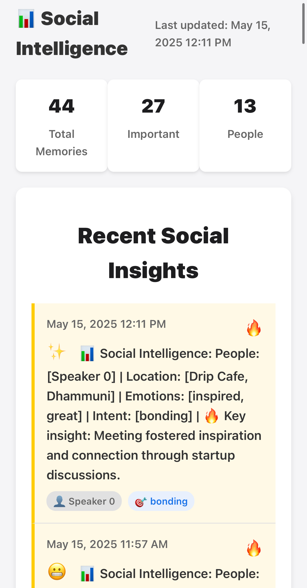
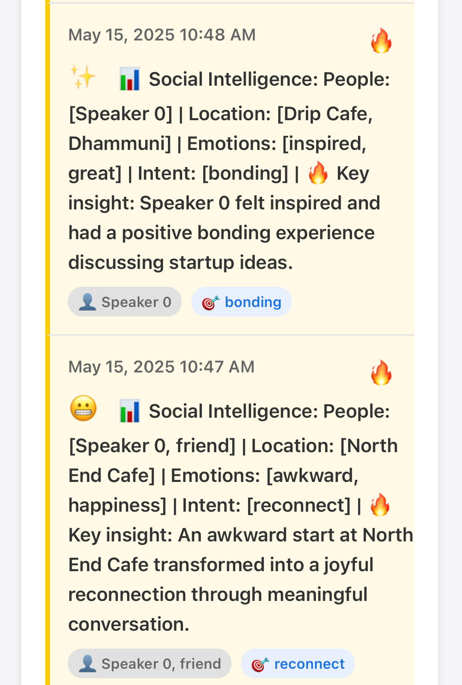

# Social Intelligence Builder

An OMI Memory Trigger integration that extracts social intelligence data from conversation memories. This Flask app processes memory trigger events from OMI, extracts relationship insights using GPT-4o, and visualizes them in a beautiful dashboard.

## Features

- **Social Intelligence Extraction**
  - People mentioned in conversations
  - Locations discussed
  - Emotions expressed
  - Social intent (e.g., bonding, arguing, reconnecting)

- **Visual Dashboard**
  - Beautiful web interface to view all insights
  - Emoji reactions based on emotions (😄 for happy, 😬 for awkward, etc.)
  - Important memories highlighted with 🔥
  - Statistics about your social interactions

- **OMI Integration**
  - Webhook for memory trigger events
  - Setup status endpoint
  - Dashboard link included in responses

## Dashboard Screenshots

<div style="display: flex; justify-content: space-between;">
  <div style="flex: 1; margin-right: 10px;">
    <h3>Main Dashboard View</h3>
    
    <p>The dashboard provides a comprehensive view of all your social insights, including people, locations, emotions, and social intent.</p>
  </div>
  <div style="flex: 1; margin-left: 10px;">
    <h3>Memory Details</h3>
    
    <p>Each memory includes detailed information about people, locations, emotions, and social intent, with important memories highlighted and emoji reactions.</p>
  </div>
</div>

## Setup

1. Clone this repository
   ```
   git clone https://github.com/intense123/social-intelligence-builder.git
   cd social-intelligence-builder
   ```

2. Create a virtual environment
   ```
   python -m venv venv
   source venv/bin/activate  # On Windows: venv\Scripts\activate
   ```

3. Install dependencies
   ```
   pip install -r requirements.txt
   ```

4. Create a `.env` file with your OpenAI API key
   ```
   cp .env-example .env
   # Edit .env and add your OpenAI API key
   ```

## Usage

1. Start the Flask server
   ```
   python app.py
   ```

2. The server will run on http://localhost:5001

3. To expose your local server to the internet (for OMI integration), use ngrok:
   ```
   ngrok http 5001
   ```

4. Configure your OMI memory trigger to point to your ngrok URL + `/memory-trigger`
   Example: `https://your-ngrok-url.ngrok.io/memory-trigger`

5. Visit `/dashboard` to view your social intelligence insights

## Testing

Run the included test script to verify your setup:
```
python3 test_app.py
```

## License

MIT
